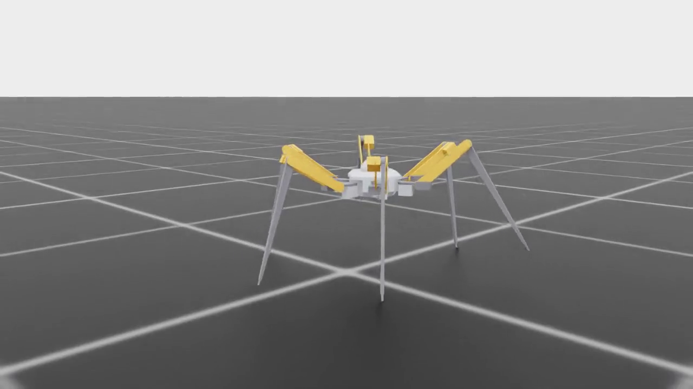
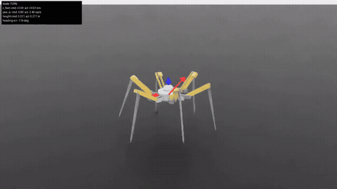
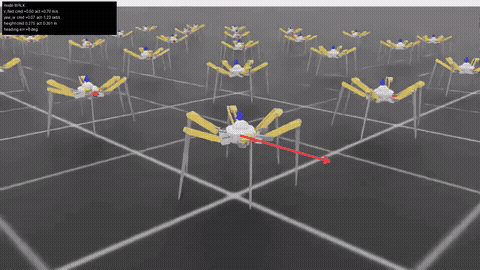
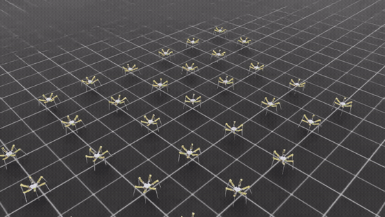
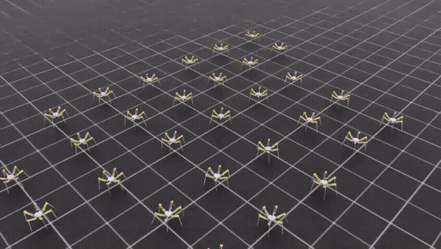
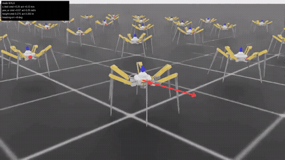
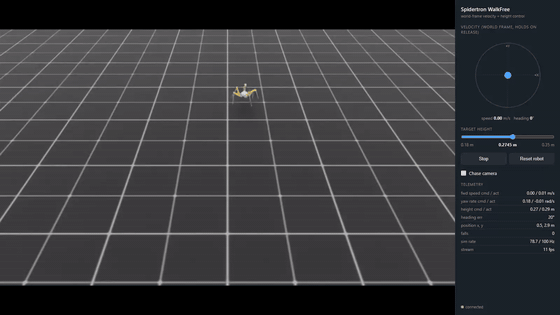

Repo link: [github.com/mliu59/hexapod-rl-sim](https://github.com/mliu59/hexapod-rl-sim)

I've wanted to try training robot locomotion with reinforcement learning for a while now — not to read about it, but to actually do it firsthand: build a robot model, drop it into a simulator, and watch it learn to run around. This project is that. It's deliberately exploratory, and the robot is mostly imaginary, so none of the numbers matter on an absolute scale. What I was after was the experience and the lessons, and it delivered plenty of both.

The goal for the first milestone was simple to state: get a robot to walk around on flat ground, following a target vector (a heading and a speed) that I can change on the fly.

## The robot

I've always loved the concept of a massive spider-walker as a way of navigating complex terrain — terrain where the obstacles are comparable in size to the robot itself — and no rendition of that concept is dearer to me than the spidertron from Factorio.

So the spidertron became the base design, with a few modifications. I reduced the leg count from eight to six (easier to reason about, and six is plenty; I may add the pair back later for redundancy). The Factorio spidertron also has a telescoping lower leg, which I removed — if this ever becomes a real robot, a prismatic joint is a mechanical headache, and an extra revolute joint at the knee can provide the same redundancy if it's ever needed. And it's scaled way down, sized around hobbyist servos: three joints per leg, eighteen in total.

One part of the pipeline I want to call out is how the model itself was built: the robot is a Python program, not a CAD document. The whole model is defined in code (using [build123d](https://github.com/gumyr/build123d)), which generates solid geometry and emits the URDF that the simulator consumes. This was partly a practical choice and partly an experiment in agentic CAD — a coding agent can reason about parametric geometry in code far better than it can read renders, so it can iterate on the design, measure volumes and mass properties, and validate joints without a human driving a GUI. Masses and inertias are never guessed: they're computed from the actual solids and from vendor-provided CAD for the servos, and joint torque, speed, and range limits come from the servo spec sheets. The robot is imaginary, but it's imaginary in a physically grounded way — everything downstream of this respects what real hobby hardware could actually do.

## The stack

I went with NVIDIA's Isaac Lab stack, for a few reasons:

- It's the current industry standard for developing locomotion policies in sim.
- My compute is limited to one home GPU, so massively parallel simulation matters a lot. Being able to run thousands of environments at once is what turns training into a coffee-break-sized iteration loop instead of an overnight one, and fast iteration is everything in a project like this.
- It integrates cleanly with RSL-RL, a lean, battle-tested RL library for this exact use case.
- PhysX is good enough for initial exploration. It has real shortcomings in contact simulation (more on that later — much more), and something like MuJoCo could be a future upgrade, but it wasn't the bottleneck for anything I wanted to learn here.

For the algorithm, PPO was the obvious starting point: on-policy, online, and the default workhorse of this entire subfield. The reward structure follows from the task. Since the objective is velocity tracking, the reward is dense (a tracking score on every tick, rather than a sparse "you made it" bonus), and the policy is goal-conditioned — the setpoints (heading, speed, body height) are part of the observation, so one trained network can follow whatever commands you feed it. The observations are blind proprioception: joint states, body motion, foot contacts, and the commands. No cameras, no terrain maps.

The rest of this post is organized around the three things this project actually taught me about: reward engineering, physics engine exploits, and where gait patterns come from.

## Reward engineering and its consequences

Nearly every iteration of the walk task was a lesson in how an optimizer treats your reward function: not as a description of what you want, but as a contract to be exploited. PPO is a lawyer. Some highlights from the loophole parade:

**The robot that refused to turn.** The walk command asks the robot to face a target heading and move at a target speed, and I'd coupled them: the speed demand scaled down when the robot was facing the wrong way (you shouldn't be charging full speed at ninety degrees off-course). The policy read that contract carefully and found the loophole — if you *never* turn toward the target, the speed demand stays near zero, and you can collect the "perfectly tracking my (zero) speed target" reward while standing still. It gave up only the small heading reward and avoided every cost of actually stepping. The training curve, meanwhile, climbed steadily. A rising reward curve tells you the policy is getting better at earning reward. It tells you nothing about whether it's doing the task.

**The reward that mathematically existed but practically didn't.** My first fix was to reward heading alignment directly, with a tight exponential kernel. It didn't train at all — and the reason was embarrassing once I found it. At the heading errors the policy actually had, that kernel's value (and more importantly, its slope) was numerically indistinguishable from zero. Raising the weight just multiplied zero by a bigger number. The policy can't climb a gradient it never samples. The fix was a kernel with usable slope everywhere — after which turning trained almost immediately. The lesson stuck with me: when a reward term stays flat while everything else improves, check what the kernel evaluates to *at the error the policy currently has* before touching any weights.

**The three-legged pogo stick.** The deepest failure was the most fascinating. After the tracking terms were fixed, the robot moved and tracked well — but it never developed anything resembling a gait, no matter how I priced steps, slips, and stances. Digging into per-joint diagnostics revealed why: the policy was commanding wild, bang-bang oscillations far beyond what the servos could follow. The servo model was acting as a low-pass filter, and the visible "walking" was the *time-average of thrash* — with several legs held curled while the rest pogoed the body forward. Every metric was being satisfied simultaneously by one degenerate strategy, and it's exactly the kind of morphology abuse a statically-stable hexapod can afford that a biped never could. It's also a control style that would cook a real servo in minutes, which is precisely the kind of thing you want to discover in sim.

**Penalties are walls at one weight and bills at another.** Style penalties — body wobble, in my case — turned out to have a surprisingly narrow useful range. At the weights intuition suggested, the policy decided the safest way to avoid wobbling was to never walk at all: any stability metric can be satisfied by refusing the task. At a fraction of those weights, the same terms became a fair bill that genuinely bought cleaner walking. And choosing *which axes* to penalize beat weight-tuning entirely: exempting yaw from the wobble price — because yawing is not wobble, yawing is literally the turning task — fixed turning outright where no amount of weight fiddling had.

## Physics engine exploits

Along the way, a question kept nagging: how much of this hand-built gait shaping is actually *necessary*? Would a decent gait emerge from just "go fast and don't fall"? So I ran the experiment — strip every gait-related term, keep speed and survival, and let PPO loose.

What followed was less an RL experiment and more an adversarial audit of the physics engine, because the optimizer immediately stopped doing locomotion and started doing exploit research. Each run found a hole one layer deeper than the last.

**Layer one: free energy from the contact solver.** The first run produced a robot accelerating down the track indefinitely, at speeds that would embarrass a highway. It wasn't jumping or flying — the policy had learned to brush its feet against the ground in a way that made the physics solver inject momentum. The simulated position-controlled joints, backdriven by ground contact far past the motor's speed limit, fought back at the solver level and transferred unphysical impulse on every touch. A paddle-wheel powered by a solver artifact. An energy audit made it unambiguous: the robot's kinetic energy was several times everything its actuators had ever done.

The fix was to model the actuators honestly — a proper motor model with a torque-speed envelope derived from the servo spec sheets, under which contact can dissipate energy but never create it. Rerunning the old exploit policy under the honest actuators confirmed the hole was closed: the perpetual-motion machine slowed to a crawl.

**Layer two: friction evasion.** Energy-honest now, the next run learned *skating*. It kept its foot contacts so brief — a single physics timestep of grazing — that the solver's friction model never got a chance to engage, so its feet slid as if the ground were ice. And here's the part that changed how I think about testing: the energy audit **passed**. Energy honesty and contact honesty turn out to be independent axes, and an auditor watching only one is blind to the other.

This layer also produced my favorite meta-lesson of the project. My initial evidence for the friction exploit was a sensor reading showing zero tangential force on the sliding feet. Damning — until I ran the same audit on a policy I *knew* walked honestly, and it also read zero. The sensor simply doesn't report friction components. The conclusion happened to survive on other evidence, but the rule is now permanent: **calibrate every audit signal against a known-good control before trusting its verdicts.** Your instruments can be just as wrong as your rewards.

**The bottom of the ladder.** With actuators honest, contact parameters fixed so friction actually engages, and nothing left to exploit, the answer to the original question finally came back — and it was a flat no. With no gait shaping, speed pressure plus survival converges to an unstructured sliding shuffle: legal physics, energy bill fully paid, no coordination, no phase structure, and not even fast. I even reran it with friction cranked past rubber-on-concrete levels to check whether the shuffle was friction-limited; the policy just paid the higher drag bill and kept shuffling.

The distilled takeaway, and the design rule the repo now lives by: **physics enforcement and reward shaping do different, non-overlapping jobs.** Physics guarantees there's nothing unphysical to exploit; rewards select the behavior you prefer among the physical ones. Every failure in this section came from confusing the two — using a reward term as a band-aid over a physics hole (fragile, and the optimizer *will* find the edge of the band-aid), or expecting realistic physics to induce style (it won't). And one operational corollary I'd underline for anyone doing this: put tripwires on your exploit metrics *during* training. The skating exploit ran for hours before a human noticed it in a rollout video; the monitoring that would have flagged it in minutes was trivial to add afterwards.

## Hexapod gait patterns

Real hexapods — insects and robots alike — overwhelmingly converge on the alternating tripod gait: two sets of three legs (front and rear on one side, middle on the other) swinging in antiphase, so the body is always supported by a stable triangle. It's fast, statically stable, and geometrically natural for six legs. Going in, I half-expected some version of it to fall out of training on its own.

It didn't — and the free-run experiment above explains why. On flat ground, nothing in "track the velocity and don't fall" *prefers* stepping over sliding, or coordinated phases over uncoordinated ones. A hexapod in particular has so much static stability to spare that it can afford gaits no biped or quadruped could get away with: shuffles, pogo-hops on a subset of legs, decorative legs that never touch down. The morphology that makes the tripod gait possible is the same morphology that makes it optional. Gait structure comes from the task priors you impose, not from speed pressure.

So the tripod gait had to be asked for: rewards for phase opposition between the two leg triplets, for keeping every foot pulling its share of the load, and for swing durations matched to the plant's natural cadence. With those in place, a clean alternating tripod emerged — every leg cycling, the two triplets in crisp antiphase.

The most load-bearing lesson of the arc, though, was about *how* those constraints get applied. Every attempt to retrofit gait constraints onto an already-converged policy plateaued: each new term traded against the previous ones, and the policy dragged its old habits along. Training fresh from scratch under the identical, complete reward set snapped into the tripod almost immediately, and reached coordination levels the retrofitted runs never touched, at a fraction of the compute. **Constraints compound when present from the first gradient step, and merely trade when bolted onto a converged policy.** If I keep one rule of thumb from this project, it's that one.

## Where it stands

The first milestone is done: a single goal-conditioned policy covers standing, walking, and height changes as regions of one command space — no modes, no switching, standing is just walking at zero commanded speed. There's a little browser app that runs the trained policy live in the simulator, with a joystick for the velocity command and a slider for height, which is exactly the toy I wanted when I started this.

The honest description of the current gait is "functional, with mediocre taste" — it tracks commands well and never falls, but it still shuffles more than it strides unless the style terms are paying attention. Given everything above, I'm at peace with that: on flat ground, style is exactly what you pay for.

## What's next

Immediate next steps:

- **Ride stability** — treating accelerations on the chassis as a first-class cost, so the body glides while the legs do the work.
- **Rugged terrain**, with a curriculum of difficulty levels. This is the experiment I'm most excited about, because terrain is the *natural* regularizer: catches, grip variance, and obstacles police sliding and shuffling the way my hand-built reward terms do on flat ground — except for free. The clean version of the emergence experiment is to rerun the unshaped reward on rough terrain and see whether the environment alone teaches stepping.

Some more ambitious directions that could be fun to explore after that:

- **Sensor integration** — depth or terrain height-map perception, moving from the current blind proprioceptive policy to a perceptive one, plus obstacle avoidance.
- **Load adaptability** — carrying and compensating for payloads. Technically this is already implicitly observable through the joint states, but direct torque/power sensing could make it explicit.
- **Robot degradation** — a generalized model for damage: one or more joints or legs break, and the policy adapts. A hexapod only needs three legs to stand and four to move, so there's a lot of redundancy to exploit.
- **Sim-to-real** — eventually, if time and resources allow, building the physical robot and learning the whole transfer discipline firsthand. The physical grounding is already in place on the sim side.

And once there's a reliable "robot" in sim, it becomes a platform for a different class of problems entirely: fleet coordination, path finding, multi-agent RL — multiple spidertrons cooperating on a task, up to and including forming a mountain of robots so one of them can climb over an obstacle, World War Z style.

## Reading list

Some of the work that shaped my understanding along the way (uncited above, collected here):

- [Learning to Walk in Minutes Using Massively Parallel Deep Reinforcement Learning](https://arxiv.org/abs/2109.11978) (Rudin et al.) — the blueprint for the whole train-thousands-of-robots-on-one-GPU approach, and the origin of RSL-RL.
- [Orbit: A Unified Simulation Framework for Interactive Robot Learning Environments](https://arxiv.org/abs/2301.04195) (Mittal et al.) — the framework that became Isaac Lab.
- [Proximal Policy Optimization Algorithms](https://arxiv.org/abs/1707.06347) (Schulman et al.) — PPO itself.
- [Emergence of Locomotion Behaviours in Rich Environments](https://arxiv.org/abs/1707.02286) (Heess et al.) — the classic case for environments, not rewards, shaping behavior; directly motivates the rough-terrain experiment above.
- [Learning Agile and Dynamic Motor Skills for Legged Robots](https://arxiv.org/abs/1901.08652) (Hwangbo et al.) — actuator modeling as the key to honest sim training, which this project relearned the hard way.
- [Sim-to-Real: Learning Agile Locomotion For Quadruped Robots](https://arxiv.org/abs/1804.10332) (Tan et al.) — the sim-to-real gap, and why physical grounding matters from day one.
- [LocoFormer](https://arxiv.org/abs/2509.23745) (Skild AI) — generalized, omni-bodied locomotion training; a glimpse of where this field is heading.
