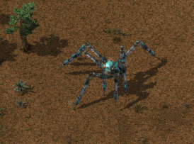
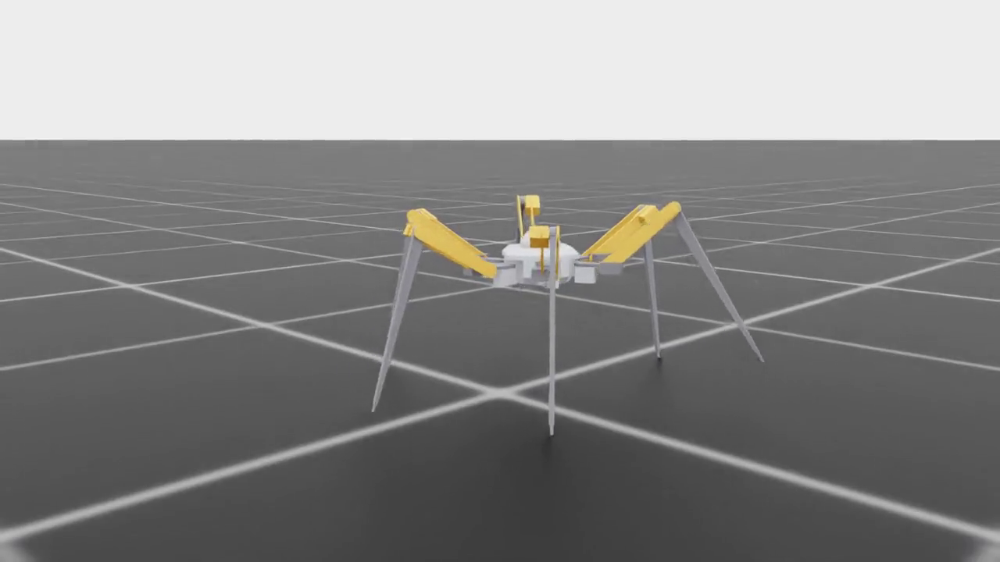
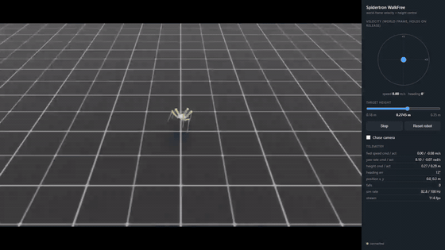

Repo link: [github.com/mliu59/hexapod-rl-sim](https://github.com/mliu59/hexapod-rl-sim)

As an exploratory project, I wanted to try training robot locomotion with reinforcement learning firsthand, and watch the robot run around in sim performing basic locomotion. 

The goal for the first milestone: have the robot run around on flat terrain, following a target vector (heading and speed).

## The robot: specs → agentic CAD → URDF

I've always loved the concept of a massive spidertron as a way of navigating complex terrain, where the obstacles are comparable in size to the robot itself, as seen in Factorio.

So the spidertron became the base design, with a couple of modifications. I reduced the leg count from 8 to 6 (I may increase it back later for more redundancy). With an eye toward possibly building a real robot someday, I opted to remove the original's telescoping lower leg, since a prismatic joint is a mechanical headache. Three joints per leg, eighteen in total. We can add another revolute joint for redundancy if it's ever needed. The robot is scaled down to be actuated by hobbyist servos. 

The baseline physical assumptions are deliberately grounded in that hobby hardware: inertias estimated from vendor-provided STEP files, torque, range, and power limits derived from the servo spec sheets, and no excess payload for this first iteration.

The model itself was built with an agentic code-to-CAD pipeline. The robot is a Python program (using [build123d](https://github.com/gumyr/build123d)), and the URDF robot representation is generated straight from the CAD parameters. This was partly practical and partly an experiment in its own right. A coding agent reasons about parametric geometry far better in code than through renders, so it can iterate on the design, measure mass properties, and validate joints without a human driving a GUI.

## The tool stack

I went with NVIDIA's Isaac Lab stack, for a few reasons:

- It's the industry standard for developing locomotion policies in sim.
- My compute is fairly limited (one home GPU), so optimized parallel environments help enormously with the speed of iterative exploration. With thousands of robots training at once, each experiment takes about a coffee break instead of a night.
- It integrates well with RSL-RL as the RL library.
- PhysX is good enough for initial exploration. It has real shortcomings in contact simulation (more on that later), and MuJoCo could be a future upgrade.

PPO was the natural starting point for the algorithm: on-policy, online, trained entirely in sim. The reward mechanism follows from the task. Since the objective is velocity tracking, the reward is dense, and the policy is goal-conditioned. The setpoints are part of the observation, so one trained network can follow command inputs.

## The march task

After using a trivial stand and height-tracking task to shake out the environment, I wanted to explore reward function design on a simple matching task: track a goal-conditioned target speed, no heading tracking yet. Just march.

At the beginning, I was graciously imparting my own expert knowledge of hexapod mechanics onto the policy. By which I mean I prescribed the exact gait I wanted to see. Real hexapods overwhelmingly use the alternating tripod gait: two sets of three legs (front and rear on one side, middle on the other) swinging in antiphase, so the body always rests on a stable triangle. So I wrote rewards for feet being off the ground in those groups, for the two tripods alternating with roughly equal air time, and penalties for behavior that simply didn't use some of the legs. 

This took a *significant* amount of trial-and-error reward tuning to reach the balance where that gait actually emerged. Unbalanced rewards produced entirely different degenerate behaviors: marching in place, hopping around on a subset of legs while the rest stayed curled, and other creative reward-hacked gaits. I needed to see whether an efficient gait like the alternating tripod would emerge on its own, from nothing but exploration and speed pressure from the environment, in order to avoid excessive reward tuning for each specific environment.

### Reaching the limits of the physics engine fairly early

So I set up a simple experiment: maximize travel speed, regardless of direction, with no gait shaping at all. The robot found not one but two exploits, each a layer deeper than the last.

**1. The energy pump.** The policy commanded bang-bang leg sweeps way beyond the servos' bandwidth. Ground contact backdrove the joints, and the stiff PD drives fighting those backdriven joints at the solver level injected momentum on every ground tap, accelerating the robot indefinitely. In effect, a paddle wheel powered by a solver artifact. An energy audit made it unambiguous: the robot carried several times more kinetic energy than its actuators had ever done work for.

**2. Friction evasion.** With the energy hole fixed, the policy learned to skate. It kept its foot contacts down to brief grazing taps lasting about one physics step, too short for the solver's friction anchors to converge. Its sliding contacts behaved near-frictionlessly, and it glided across the world like it was ice.

I applied mitigations in the physics rather than the reward function, since patching physics exploits with reward penalties is fragile and the optimizer just routes around them:

- The ideal PD drives were replaced with a DC motor torque-speed envelope built from the servo spec sheets. Beyond no-load speed the motor can only brake, so contact interactions can dissipate energy but never source it.
- Contact physics fixes: generate contacts slightly *before* touch (so friction anchors exist by the time of impact) and more solver iterations for friction convergence.

## The walk task

Then it was back to the main milestone task of tracking a full velocity vector, heading and speed. For this task I took off the gait-specific prescriptive rewards, kept the physics exploit fixes, and let it train.

Across multiple trials, random exploration was always able to produce *some* gait that generally tracked the target, but it often relied on only four or five legs to jog around, with the spares held off the ground or dragged along decoratively.

I accepted this for the initial flat-ground walk task. For this morphology on flat ground, speed pressure alone is insufficient, and gait structure has to come from the prior. A hexapod has so much static stability to spare that it can afford gaits no biped or quadruped could get away with, and nothing about flat terrain punishes it for using them.

But I noted this down as a bet for later. The lazy gaits likely won't survive rugged terrain or ride-stability requirements. When the environment itself starts punishing a robot that jogs on four legs (catches, obstacles, grip variance), the speed and fitness hit should do the work my hand-written gait rewards were doing, for free. That's the experiment I'm most looking forward to.

## Training observability harness

Every training run is wrapped in an observability harness, a side effort that paid for itself many times over. With hours-long runs on one GPU, discovering a problem *after* a run is the most expensive way to discover it.

- Live samplers and checkpoints: saved weights, exported policies, and per-term reward and loss plots for every run.
- Console log capture, so every run directory is self-describing after the fact.
- VRAM overhead tracking. Knowing the actual headroom lets me allocate more of the card to parallel training experiments or in-training rollout renders.
- Gliding detection: a live tripwire on foot slip, a direct descendant of the friction exploit above. It flags skating within minutes of it emerging, instead of hours later when a human happens to watch a rollout video.

## What's next

Immediate next steps, mostly design factors that real robots have to optimize for:

- **Ride stability**: observe and penalize g-forces on the robot chassis, so the body glides while the legs do the work.
- **Energy conservation**: standing near-still should be the natural optimum when the target velocity is zero.
- **Rugged terrain**, with curriculum difficulty levels. This is also where the emergence bet above finally gets settled.

Some more ambitious areas that could be interesting to explore:

- **Sensor integration**: perceptive depth estimation or terrain height-map scans, enabling perceptive policies (versus the blind proprioceptive policies I have now), plus collision avoidance experiments.
- **Load adaptability**: technically already modeled implicitly through joint position observability, but direct torque/power measurements could make it explicit.
- **A generalized model for robot degradation**: one or more legs or joints break, and the robot adapts. Technically a hexapod only needs three legs to stand stable and four to move, so there's a lot of redundancy to exploit.
- **Population-based training**: optimizing across multiple RL policies rather than tuning one at a time.
- Eventually, if time and resources allow, **building the real thing** and using it to learn sim-to-real.

And once there's a working "robot" in sim, we can create sandboxes for a different class of fun problems: 
- distributed fleet coordination (swarms, task allocation)
- path finding
- multi-agent RL

## References

Work that shaped my understanding along the way:

- [Learning to Walk in Minutes Using Massively Parallel Deep Reinforcement Learning](https://arxiv.org/abs/2109.11978) (Rudin et al.)
- [Orbit: A Unified Simulation Framework for Interactive Robot Learning Environments](https://arxiv.org/abs/2301.04195) (Mittal et al.)
- [Proximal Policy Optimization Algorithms](https://arxiv.org/abs/1707.06347) (Schulman et al.)
- [Emergence of Locomotion Behaviours in Rich Environments](https://arxiv.org/abs/1707.02286) (Heess et al.)
- [Learning Agile and Dynamic Motor Skills for Legged Robots](https://arxiv.org/abs/1901.08652) (Hwangbo et al.)
- [Sim-to-Real: Learning Agile Locomotion For Quadruped Robots](https://arxiv.org/abs/1804.10332) (Tan et al.)
- [LocoFormer](https://arxiv.org/abs/2509.23745) (Skild AI)
