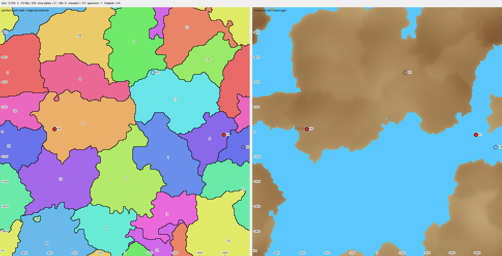

- ***(K/C)arto-***: from *Cartography*. Borrowed from the French *cartographie* in the 1840s, itself based on Medieval Latin *carta*, "map".
- ***-gen***: short for "generator".

Repo link: [github.com/mliu59/kartogen](https://github.com/mliu59/kartogen)

`Kartogen` is a deterministic world generator I've been building as a personal side project. My goal is to repeatably generate realistic, natural-looking, earth-inspired geographies that can be used for anything: simulations, worldbuilding, video games, and so on.

`Kartogen` started out as a subcomponent of a larger agent-based macro-history simulation I'd been mulling over (placeholder name `historygen` for now). But once I started building the simulation's world, I realized that generating "realistic"-looking worlds for it to run in was a big enough task on its own to justify a standalone project — and so `Kartogen` was born.

`Kartogen` itself doesn't use any generative AI for world building, but I did lean on AI heavily for the research and development behind the generator. More on that below.

## Personal Motivation

`Kartogen` and its parent project `historygen` feel like a natural — and partly inevitable — extension of my interests and hobbies. Ever since I was a kid, I've been fascinated by cartography; I'd draw countless real and fictional maps on paper whenever I got the chance. As I grew up, I also found myself engrossed in history, eventually doing a History minor in undergrad. And I've always played a lot of video games, most of all in the grand strategy / 4X genres (Civ, Europa Universalis, and the like).

Building a world-and-history simulation environment has always been something I wanted to do, since it sits comfortably at the intersection of all my interests. With AI agents, I finally have the bandwidth to take on a project this open-ended. I think it's a great creative outlet, as well as an incredible opportunity to learn more about earth and human geography — and about how to better use AI on a software project where AI isn't necessarily an ideal collaborator.

## AI Use

As mentioned above, `Kartogen` is built to be a deterministic world generator, so by design it doesn't rely on any LLMs or similar generative models for world construction. That said, I have been — and plan to keep — using AI for:

- **Coding**. For this, I primarily use Claude Code with its latest Opus models.
- **Research**. As someone with only hobbyist-level knowledge of geology, natural history, climate science, etc., I use AI to fill in general knowledge gaps and connect concepts together. I also use it for deep research into prior art across various modeling techniques.

I think this project can be challenging to pull off, especially with an AI collaborator, because of a few anticipated hurdles:

- How do we convey the feeling of a map looking "natural" or "realistic" to a model? I think this is the most significant challenge.
- If we want the AI to explore more autonomously, how do we balance the project's complexity and scope against the AI's tendency to hyperfixate on individual features?
- How do we build observability infrastructure and tooling into the generation pipeline so the AI can autonomously discover and fix anomalous behavior?

I'll be documenting my learning experience using AI on this project along the way. Stay tuned!
