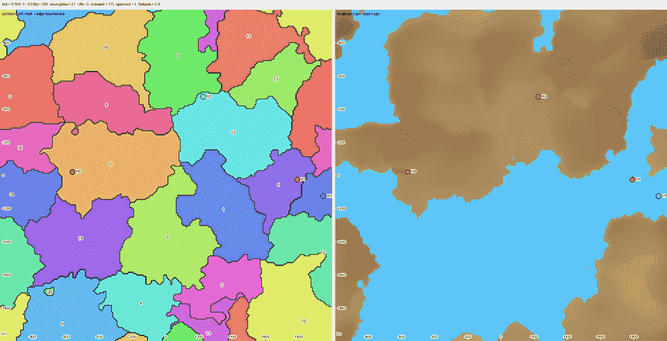
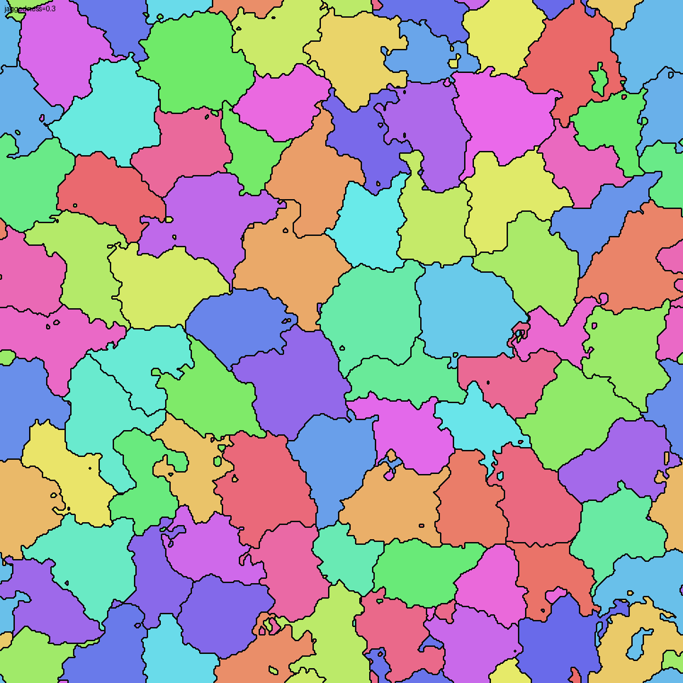
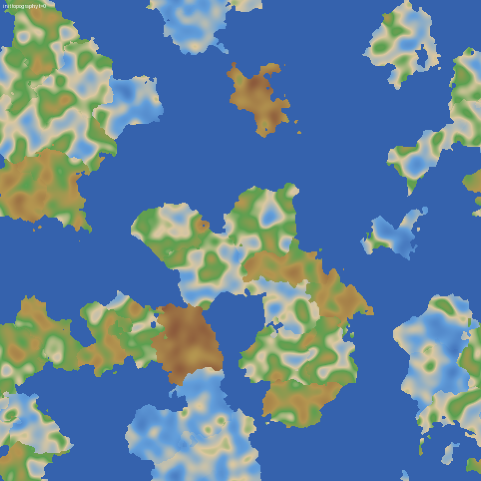
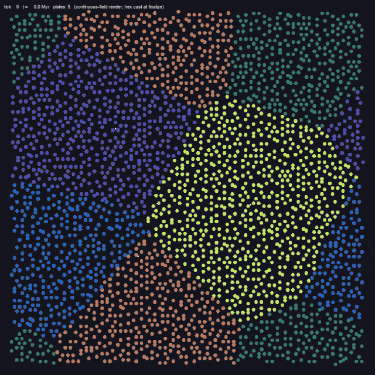
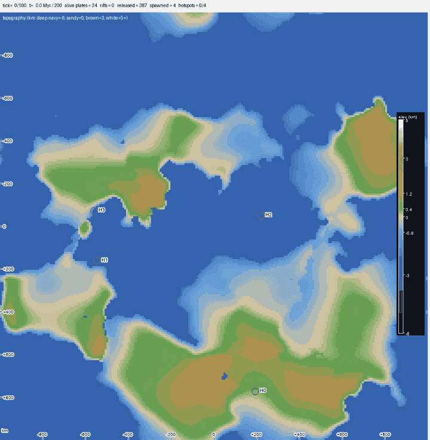
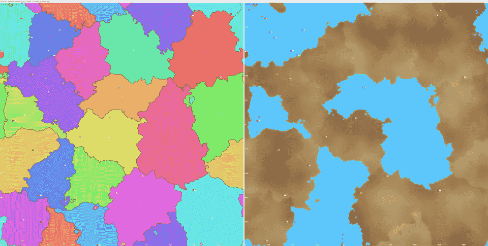

[Link to project intro](/blog/kartogen/intro)

In order to capture the underlying dynamism that drives Earth's geography, I opted to develop a simulation engine for plate tectonics (`tectonic-sim`), though it's likely more of a creative representation of the higher-level concepts than an accurate plate tectonics simulation.

Given some initial configuration in a simulated space, the world grows by itself over some simulation window (say ~200 Myr) on a 2D torus world (the edges of each dimension are continuously connected), forming everything from continental mountain ranges and plateaus to basins and deep sea rifts. This tectonic simulation module then serves as the baseline for downstream generation such as climate, precipitation, etc.

Currently `tectonic-sim` tries to model:
- Plate kinematics (translation and rotation about an Euler pole in a torus world)
- Plate kinetics (semi-rigid behavior: momentum and mass transfer, deformation, fusion)
- Plate types and interactions (continental vs. oceanic crusts)
- Subduction and rifting (adding and removing crust mass from the system)
- Fold and thrust mechanics (formation of inland elevation gain)
- Isostasy (naive mapping between crust thickness -> elevation)
- Mantle hotspots (formation of volcanic island belts)

Like [`kartogen`](/blog/kartogen/intro), `tectonic-sim` is pseudorandom and deterministically driven by configs and seed. A lot of the modeling techniques used are pretty aggressive simplifications of the underlying physics of plate tectonics, as I wanted to ensure the simulation captured the higher-level concepts without overencumbering the system with a full physics simulation. The goal was to be able to generate reasonably sized worlds in a reasonable amount of time with just a single CPU core. 

Currently, (I think) `tectonic-sim` does a decent job of forming believably realistic-looking plate geography over time. 

A couple of highlights:
- Continental-continental crust collisions properly dampen momentum for involved plates, which also results in mass transfer, crust thickening, and sometimes plate fusion (e.g. Indian and Eurasian plates -> Tibetan Plateau)
- Different plate collisions properly handle subduction patterns (even though we don't have a density/buoyancy model). Denser oceanic crusts subduct under less dense continental crusts, while at oceanic-oceanic boundaries, crust age often determines its density and subduction
- The world generates fresh crust at diverging plate boundaries, both continental and oceanic (e.g. East African Rift)
- When constrained by behavior of neighboring plates, plates will deform and shear, sometimes even creating microplates. 
- Mantle hotspots generate cute island belts during its active lifetime :D (e.g. Hawaii, Yellowstone)

There is also some behavior that seems a bit unnatural — more on that below. However, this seems like a solid foundation to move on to the downstream processes in `kartogen`.

## Seeding Plates

For this module, the initial conditions of the simulation often dominate the final look of the plates, since the simulation environment spans a limited time window. 

To start, I am using a fairly naive Voronoi tessellation method to partition the torus world into distinct plates, basically assigning each cell to the nearest plate origin point using their torus-aware distances. However, a plain nearest-seed partition produces obviously artificial boundaries: straight edges and tidy convex polygons. So we can distort the distances with a domain-warp and use weighted-Voronoi to make the plate boundaries more irregular and natural, as well as to introduce variation in plate sizes. 

{h=400}

Each plate is then randomly assigned a crust type (continental vs. oceanic, based on config bias). To simulate some initial variation in elevation within each plate, I perturb each plate with a low-frequency, zero-mean fractal noise field in crust thickness — a kind of ancient basement topography. Because elevation is derived from thickness via isostasy, the thin spots later become shallow seas, shelves, and straits, while the thick spots stand up as highlands. This trick determines a significant portion of the world's eventual topography, and it doesn't look incredibly natural at the moment, so it will be a focus of future improvements. 

{h=400}

Finally, we can set everything in motion by assigning an initial rotational rate, bulk speed, and bearing. This essentially gives the semi-rigid plate an independent Euler pole for its kinematic profile. 

## Plate Body Representation & Kinetics

Before arriving at the current continuous polygon representation of plates, I had previously experimented with using `kartogen`'s hex-grid native representation as well as a particle-based representation to simulate some elasticity. The hex-grid native solution was just too constraining in terms of its geometry, and basically did not allow a rotational mechanic. The particle-based representation caused some undesirable behavior with continents phasing through each other, which made it look more like a fluid simulation than anything else, but was pretty fun to watch.

{h=400}

Ultimately, a polygon-based representation of the plate body in continuous 2D space, with rasterization onto a shared 2D torus world grid, works quite well. Each plate stores its own crust state (shape, thickness, age, type) in a fixed body frame, and only its pose (position and orientation) changes from tick to tick. The simulation stamps every plate down onto the shared world grid according to its current pose, runs all the inter-plate physics on that shared view, and propagates the changes back onto each plate's body frame at the end of the tick. The round trip is built to be mass conserving, and to behave correctly across the torus seam, which is exactly where this kind of simulation tends to fall apart.

When two plates contend for the same cell, each plate's crust properties (thickness, age, type) drive the interaction. The engine resolves a near-inelastic momentum exchange, in the way real lithospheric slabs behave, so contacts bleed off relative velocity rather than rebounding. Converging continental pairs get extra damping so they decelerate to a stop instead of plowing through each other indefinitely. For ownership of the contested cell, a priority rule weighted heavily toward continental crust kicks in, which is how oceanic lithosphere ends up subducting *beneath* a continent rather than overriding it. Among oceanic cells contending, younger crust wins, mirroring the idea that older, denser ocean floor is the one that tends to dive.

A few slower processes ride on top of the motion. Crust ages everywhere, and young oceanic crust rides slightly higher before cooling and subsiding (more on that under Isostasy). Along continental margins above subducting ocean floor, arc magmatism progressively accretes new continental material onto the overriding edge. Once two plates have been in contact long enough, and their relative velocity has dropped low enough, they can also fuse into a single plate, the way smaller blocks accrete into continents over geological time.

In the opposite direction, any disconnected fragment sheared off a plate is either promoted to its own (micro)plate or redistributed to a neighbor, never just discarded, so total crustal mass is conserved.

## Rifting and Folding Mechanics

The most dramatic geography shows up at plate boundaries, where plates are either diverging or converging.

At divergent boundaries, a gap opens between the separating plates, and I fill it with fresh, age-zero crust to represent new oceanic lithosphere forming at a mid-ocean ridge. If the opening is surrounded by continent though, like a rift propagating through a landmass rather than an ocean widening, I fill it as a low continental basin instead. The idea is to capture the kind of foreland or intracontinental trough that forms between converging blocks.

At convergent boundaries between two continents, neither slab can subduct, so the crust has nowhere to go but up. I model the resulting orogeny by transferring the losing plate's crustal column inland and depositing it as a fold-and-thrust belt. It is worth noting that mountain ranges formed by folding mechanics do not have a single spike right at the suture. For this simulation, I opted to create a broad, elevated plateau set back from the contact (a Tibet or Altiplano analogue), with a narrower, sharper foothill range mirrored on the far side, like the Himalaya to that plateau. We can then create more orogenic texture in downstream processes with glaciation and erosion. I also damp these continental collisions so the convergence doesn't run away into unrealistically tall peaks. You can see this behavior in the case below, especially with the colliding continental plates at the bottom right. 

## Direct Improvement Areas

With its current configuration, there are a number of noticeable features that make the output worlds look jarring. The case below has a good amount of everything. 

- Plates are not rigid enough, which shows up as extreme deformation, often completely decimating large portions of continental crust and features during shearing and collisions. 
- Rifting regions will often create dozens of independent microplates. This is okay for the most part, but they don't fuse often enough with neighboring plates. 
- The noise function used to perturb the initial topography of continental plates is almost too noisy, often creating an excess of basins and inland seas and fragmenting large pieces of continental mass. 
- Plate borders often have extremely large and sharp changes in elevation, starting from t=0. More research can be done to see what features naturally form at these boundaries. 
- Continental rifting looks very poor, also partly due to plates being not rigid enough.

## Future Exploratory Directions

There are a number of interesting phenomena that could be integrated into the sim for more accurate and realistic results: 

- Proper continental rifting mechanics. 
- Conceptual-level geological composition properties (such as density), which could better inform plate-to-plate interactions
- Given how limiting the current pseudo-physics interpretation of tectonics is for future work, we could make a case for a full 3D physics simulation.

## Developing with AI

AI as a coding assistant for this project has been great. The development velocity boost that coding agents provide means that I can iteratively experiment with modeling concepts quickly, and therefore converge on good solutions faster. I basically do not edit any code directly, but rather tell the coding agent to do the editing for me, keeping me more focused on higher-level decisions. However, one area where I do feel increasingly bottlenecked is the tuning stage of the underlying filters and models, since this very often affects how "realistic" and "natural" an output looks. It took me longer to get an acceptable set of tuning parameters for continent-continent collision velocity damping than it took me to do a full rewrite of the plate body representation system from particles to continuous polygons.

For that reason, my attempts at pushing AI to be more autonomous in this plate tectonics simulation have been challenging. The AI has no good way to evaluate its outputs, partly because it does not understand the abstract concept of "realistic-looking" geography in this context, and partly because there's no diverse ground truth to evaluate against. While current plate motions are directly measurable with modern instruments (GPS, InSAR, and so on), the timescales that actually build geography are tens of millions of years long, and nobody has ever watched a continent collide or an ocean basin open. Everything we know about plate dynamics is reconstructed after the fact from the geological record it leaves behind: mountain belts, sedimentary basins, magnetic stripes, fossil distributions. Ironically, a simulation like this one is one of the only places anyone can actually watch plate tectonics play out at all.

This makes evaluation of individual tectonic mechanisms awkward. The signals I actually have to work with are the downstream geological features: mountain ranges, coastlines, island chains, rift basins. In-simulation observability tooling (such as the GIF rendering) is helpful for identifying contributing factors to a specific output feature, but it can't be directly used as an evaluation metric.

When evaluating just the final output of the simulation, the question still splits into two main areas: whether the output is physically plausible, and whether it looks natural. Plausibility checks are anchored in invariants and aggregate constraints. For example, the continent-to-ocean area ratio shouldn't change wildly between t=0 and the final tick (mass should be roughly conserved). Those are easy for the AI to compute and interpret, but they're aggregate, and a simulation can pass every aggregate test while still producing geography that's obviously wrong (an unbroken belt of continent stretching around the equator, perfectly straight coastlines, and so on). The naturalness checks are where it gets harder: I can ask the AI to compare the distribution and derivatives of elevation in a mountain region to a real-life counterpart like the Tibetan Plateau or the Andes, but the comparison is inherently qualitative, and it's exactly the kind of subjective judgment the AI struggles with.

I've been using multimodal models for development, so I've also tried using them to directly read and interpret visualizations made for humans. There have been a number of times when Claude would look at the output and exclaim about how "incredibly Earth-like" the result was, only for it to turn out to be an edge case (all oceans, no land) or riddled with generation artifacts caused by engine bugs. I've also tried pointing the AI at a specific visual and pointing out the coordinate area where I could see some generation artifact (such as an abnormally straight edge), but it would not recognize it at all, sometimes even hallucinating features to force an answer. That said, despite not being the best at interpreting custom and uncommon map visuals, Claude's multimodal models are very accurate at reading well-formatted line plots, which I have the AI use often as a topography inspection tool.

This suggests that to use AI effectively for evaluating abstract concepts like "realism" or "natural look" without extensive post-training, the abstract concept has to be reduced to a set of concrete, testable metrics. For now, that translation has to come mostly from humans. A few examples of what those constraints might look like:
- Along any cross-section of the elevation map, the slope distribution should fall within bounds derived from Earth-like topography. Strict C^2 smoothness would be too restrictive, but the curvature distribution shouldn't have wildly anomalous tails either.
- No straight or near-straight edges in coastlines or elevation contours longer than some threshold. This one would directly catch most of the engine-bug artifacts I've run into.
- Given a local elevation maximum, the surrounding topography shouldn't be too rotationally symmetric. Real mountain ranges have asymmetric profiles driven by erosion gradients, fold direction, and tectonic geometry.

Constraints like these would help right now in catching artifacts in the current tectonics output, and they'll matter even more in the next stage of `kartogen`, when I start texturing and chiseling the continents with glaciation and dynamic erosion.

