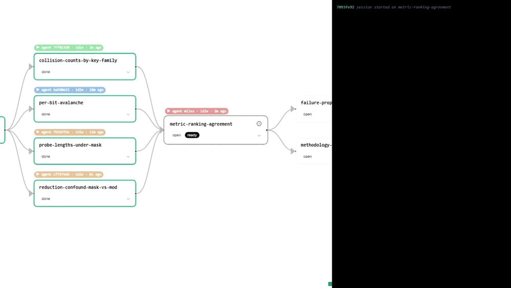
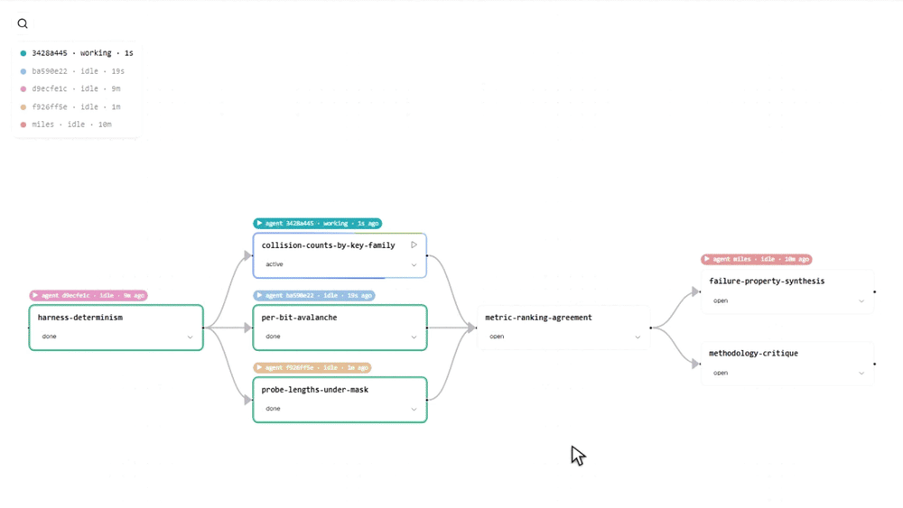

```bash
npx skills add mliu59/agent-taskmap
```

`agent-taskmap` is a lightweight agent skill that aims to solve the planning and coordination problems that come with using multi-agent systems on dynamic, long-horizon tasks, where priorities and research directions change based on what has already been learned.

## The problem

Here's an example scenario. You instruct your agents to semi-autonomously conduct a series of time-consuming, exploratory experiments to evaluate a system. Many of these experiments rely on conclusions drawn from earlier ones. You had some core assumptions about the system that seemed true at planning time, but the early experiments proved them false. That revelation invalidates many of the downstream subtasks you had in mind and opens up a whole new research path. An agent is able to autonomously propose an updated plan, but how do you weave it into the existing workflow and propagate it to your swarm of agents? And how can you, the human research supervisor, monitor these decisions, provide your own input and guidance, and get a high-level overview of the task as a whole, without committing to a bulky agent orchestration platform? `agent-taskmap` aims to fill this planning gap.

In essence, `agent-taskmap` uses a computational graph to represent a dynamic research task. The work from upstream nodes informs downstream nodes, and multiple agents can concurrently work parallel research branches without interfering with one another. This "taskmap" is saved on disk as a human-editable, structured text artifact, and every collaborating entity uses it as a high-level planning reference, much like a human engineering team working off a shared project flowchart. Note that `agent-taskmap` is NOT an agentic orchestration runtime. It is an interface for generating and maintaining reference artifacts.

## How it works

The plan lives in `.taskmap/` in the repo as a graph of subtask nodes. Each node has an input (what it asks or seeks to achieve), an output (what working it produced), and a one-line conclusion that downstream nodes inherit and index on. Agents use the taskmap as a tracker of outstanding subtasks, the status of their dependencies, and what are available subtasks to work on. Once an agent decides to work on an open subtask, it will claim it to indicate it is being worked on. Once complete, the agent write the output statuses and is *encouraged* to produce artifacts as proof of work. From there the node is marked as `done` and the agent session is free to inspect the map again and claim the next available task or wait on prerequisite conditions. 

{w=750}

A `tm` CLI is the primary interface for reading and writing the taskmap, and a `taskmap` skill in the open [Agent Skills](https://www.skills.sh/) format tells agents how to drive it. To keep the shared artifact as accessible as possible, it is implemented as a collection of structured text files. The CLI is the cleaner edit interface, but direct file edits by agents and humans in a text editor are considered valid too. With that in mind, the CLI makes a best effort to keep reads and writes safe across sessions and to catch stale reads, but it cannot guarantee that every operation is fully serializable and atomic.

As a lightweight addition to agent workflows, a taskmap is meant to be an advisory reference and does not enforce adherence. With proper prompting, agents follow the planning artifact quite well.

### `.taskmap` artifacts

Each task is a folder under `.taskmap/`, and each node in it is three plain files: a small TOML file of metadata, a markdown file for the input, and a markdown file for the output.

```
.taskmap/<task>/QUESTION.md            the guiding question this task answers
.taskmap/<task>/INSTRUCTIONS.md        standing system instructions every session sees
.taskmap/<task>/nodes/<id>.toml        name, summary, conclusion, status, dependencies, claimants
.taskmap/<task>/nodes/<id>.input.md    what the node asks
.taskmap/<task>/nodes/<id>.output.md   what working it produced; free-form, never parsed
artifacts/<task>/<id>/                 files the work wrote
```

- **Node I/O is free-form.** A node's record and instructions can be whatever the task's instructions ask for: a results table, a log, paths to plots.
- **Statuses are simple.** A node can be `open`, `active`, `done`, or `blocked`;  where `done` is terminal; `blocked` is not.
- **Writes are signed.** The CLI stamps every change with the session that made it, so the map records who claimed a node, who last changed it, and when. Sub-agents sign under a dotted lineage id so delegated work is traceable to the session that spawned it.

### GUI

`tm ui` serves the task map in a browser and follows the files as they change, so the human sees the same graph the agents are working. The GUI and server is not required for using the taskmap, but is a very human friendly interface for tracking tasks and making edits. 

{w=750}

The GUI is designed to be similar to whiteboarding tools. You can draw nodes and edges on its canvas, inspect and edit the nodes' data content, and it attempts to applies the changes to the taskmap. The GUI also tracks the status of each agent currently working on the active task with highlighted cursors and signed session IDs. Cosmetic edits such as layout, colours, and card sizes are saved alongside the map but are never read by agents.

## Status

In early development. See the [GitHub repo](https://github.com/mliu59/agent-taskmap) for setup instructions and how to integrate it into your agentic workflows.
