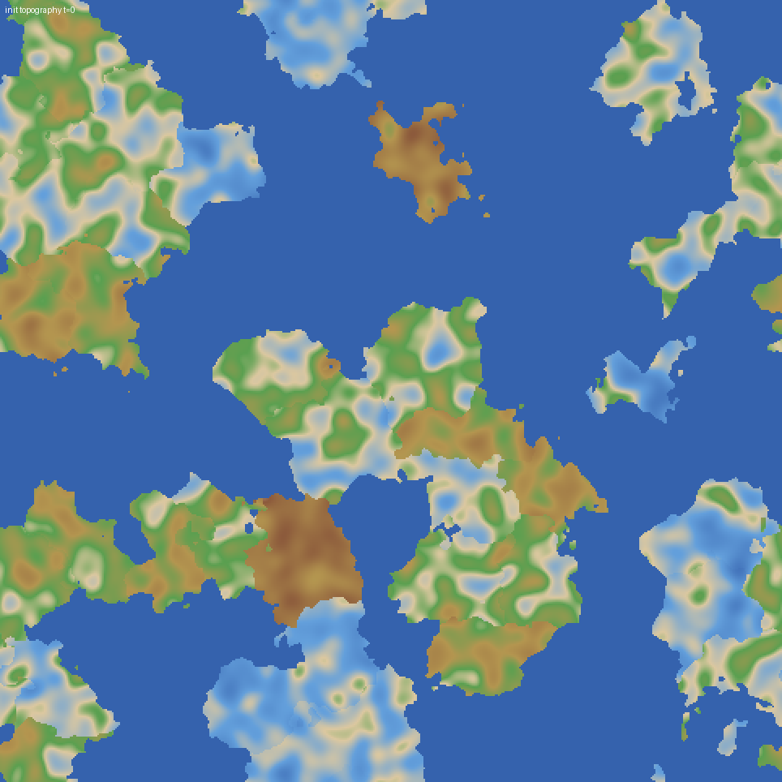

Kartogen is a procedural world generator that tries to produce *plausible* planets rather than noise-based ones. Instead of layering Perlin noise, it simulates tectonic plates drifting over a sphere and derives terrain from where plates collide, subduct, and pull apart.

## What it does

- Seeds a sphere with plates using a particle-based representation and lets them drift.
- Builds topography from plate boundaries: mountain ranges at convergent edges, rifts and ridges at divergent ones.
- Renders intermediate state so each stage of the simulation can be inspected visually.

## Status

Early and exploratory. The tectonic simulation works end to end at low resolution; the next milestones are erosion, climate, and biome assignment. Progress notes live in the blog, filtered under the Kartogen project.
